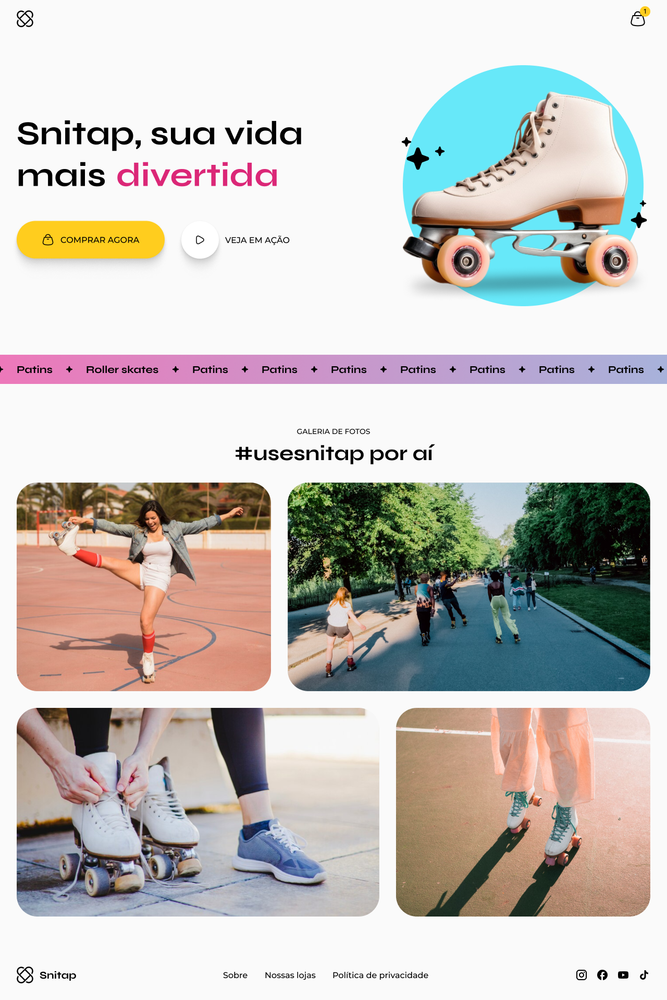

# Snitap Project

## General Description

This project is a study focused on CSS animations and transformations, aiming to create an interactive and visually appealing user experience. The project is a landing page to promote the Snitap brand roller skates.

## Project Purpose

The purpose of this project is to study and implement advanced CSS animation and transformation techniques, applying these concepts in a realistic site that serves as a landing page for a product.

## Figma Design

Below is a screenshot of the design created in Figma that was used as a reference for developing this project:



## Final Product Description

### Header

The site header includes the product name, an attractive slogan, and two call-to-action buttons:

- "Buy Now"
- "Watch in Action"

### Navigation

A horizontal navigation menu with links to various important sections of the site, highlighted in pink.

### Photo Gallery

A section called "#usesnitap around", presenting a photo gallery of users using the skates in different scenarios, promoting the lifestyle associated with the product.

### Footer

The footer contains links to additional pages such as "About", "Our Stores", and "Privacy Policy", as well as social media icons to connect users with the brand on social platforms.

### Responsive Design

The site layout is responsive, adapting optimally to different devices, including desktop and mobile.

### Visual Style

The site design is modern and vibrant, using attractive colors and images, along with smooth animations and transitions to create an engaging user experience.

### Planned Animations and Transformations

1. **Hover Animations**:
    - **Logo, Cart Icon, and Buttons**: Elements such as the logo, cart icon, and buttons will have hover animations to enhance interactivity.
2. **Image Display Animations**:
    - Images will animate as they appear on the screen, providing a dynamic visual experience.
3. **Header Roller Skate Animation**:
    - The roller skate in the header will animate by sliding in from the right side of the screen.
4. **Scrolling Banner**:
    - The pink/purple banner in the center with the word "Patins" will have a scrolling animation, moving from side to side like an animated ticker.

## Learning Objectives

- Implement advanced CSS animations.
- Use CSS transformations to create dynamic visual effects.
- Develop a responsive design that adapts well to different devices.
- Create an interactive and engaging user experience.

## Live Demo

Check out the live demo of the site [here](https://ivanseibel.github.io/mba-rocket-snitap/).

## Key Concepts and Techniques

### Responsive Typography

Responsive typography adjusts the font sizes and line heights based on the screen size. This ensures that text is readable on all devices, providing a better user experience.

Example:

```css
h1 {
  font-size: 2rem;
}

@media (min-width: 80em) {
  h1 {
    font-size: 3rem;
  }
}

```

### CSS Grid Layout

CSS Grid is used for creating complex and flexible layouts. It allows for precise placement of elements and can be easily adjusted for different screen sizes.

Example:

```css
.container {
  display: grid;
  grid-template-columns: 1fr;
  gap: 1rem;
}

@media (min-width: 80em) {
  .container {
    grid-template-columns: repeat(3, 1fr);
  }
}

```

### Flexbox for Alignment

Flexbox is used for aligning items within a container. It provides flexibility and control over the layout, ensuring that elements are properly aligned and spaced.

Example:

```css
.nav {
  display: flex;
  justify-content: space-between;
  align-items: center;
}

.btn-group {
  display: flex;
  gap: 1rem;
}

```

### CSS Variables for Theming

CSS variables are used for consistent theming and easier maintenance. They allow for defining a color palette and reusing values throughout the stylesheet.

Example:

```css
:root {
  --snitap-sun: #FFCD1E;
  --snitap-sky-mid: #06B6D4;
  --snitap-sky-light: #67E8F9;
  --snitap-joy-mid: #DB2777;
  --snitap-joy-light: #F472B6;
  --snitap-leaf-mid: #16A34A;

  --text: #000;
  --highlights: #000;
  --background: #FAFAFA;

  --ff-base: 'Montserrat', sans-serif;
  --text-sm: 0.875rem;
  --text-base: 1rem;
  --text-lg: 2.5rem;
  --text-xl: 4rem;
}

```

### CSS Animations and Keyframes

CSS animations and keyframes are used to create smooth transitions and dynamic visual effects. These animations enhance user engagement and add a layer of interactivity.

Example:

```css
@keyframes slideRightToLeft {
  50% {
    transform: translateX(-20px);
  }

  100% {
    transform: translateX(0);
  }
}

@keyframes appear {
  to {
    opacity: 1;
  }
}

@keyframes slideUp {
  0%, 22% {
    transform: translateY(0);
  }

  23% {
    transform: translateY(calc(-5rem - 10px));
  }

  25% {
    transform: translateY(calc(-5rem + 5px));
  }

  27% {
    transform: translateY(calc(-5rem - 5px));
  }

  29% {
    transform: translateY(calc(-5rem + 5px));
  }

  33%, 55% {
    transform: translateY(-5rem);
  }

  56% {
    transform: translateY(calc(-10rem - 10px));
  }

  58% {
    transform: translateY(calc(-10rem + 5px));
  }

  60% {
    transform: translateY(calc(-10rem - 5px));
  }

  62% {
    transform: translateY(calc(-10rem + 5px));
  }

  66%, 88% {
    transform: translateY(-10rem);
  }

  89% {
    transform: translateY(calc(-15rem - 10px));
  }

  91% {
    transform: translateY(calc(-15rem + 5px));
  }

  93% {
    transform: translateY(calc(-15rem - 5px));
  }

  95% {
    transform: translateY(calc(-15rem + 5px));
  }

  100% {
    transform: translateY(-15rem);
  }
}

```

## Best Practices

In this project, several best practices were implemented to ensure high-quality code and a maintainable design:

- **Modular CSS**: Using separate CSS files for different components to maintain clean and organized code.
- **CSS Variables**: Leveraging CSS variables for consistent theming and easier maintenance.
- **Accessible Design**: Ensuring that the site is usable for people with different abilities by following accessibility guidelines.

## Conclusion

This project served as an invaluable exercise in honing advanced CSS techniques and best practices. By focusing on animations and transformations, the project provided a comprehensive platform for practicing and improving web development skills. The emphasis on modular CSS ensures that the resulting code is not only functional and visually appealing but also maintainable and scalable. The insights and skills gained from this project can be applied to future web development tasks, contributing to more efficient and effective design and implementation processes.